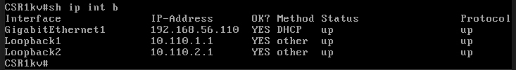

# Network NETCONF Loopback Automation (Python | Cisco Network Automation)

 
 


> **Portfolio Project: This repository showcases my Python development and network automation skills, focused on Cisco routers using NETCONF and YANG.**

---

## Project Overview

This Python project automates the creation of Loopback interfaces on Cisco routers using NETCONF and YANG models.  
It is designed as a clear, modular, and production-quality script that demonstrates **network automation** with Python.

- Written entirely in Python 3, following best practices for software engineering.
- Uses `ncclient` (NETCONF client) and `xmltodict` for XML handling.
- Secure credential input and robust error handling.
- Code is fully documented and modular, with type hints and optional NETCONF XML debug output.

---

## Features

- **Automated Loopback Creation:** Connects to multiple routers, creates one or more Loopback interfaces per device.
- **Dynamic IP Assignment:** The script uses the router's last IP octet as the second octet in each Loopback IP, ensuring uniqueness.
- **Interactive & Safe:** Preview changes, confirm before applying, and choose whether to save to startup-config.
- **Comprehensive Logging:** Summarized results and detailed logging for troubleshooting.
- **Custom Descriptions:** Set interface descriptions for easy identification.

---

## Requirements

- Python 3.6+
- Cisco router with NETCONF enabled (`port 830`).
- Python packages in `requirements.txt`:
    - `ncclient`
    - `xmltodict`
    - `tabulate`

---

## Installation & Usage

1. **Clone the repository and navigate to the project folder:**

    ```bash
    git clone https://github.com/GabrielNetSec/netconf-loopback-auto.git
    cd netconf-loopback-auto
    ```

2. **Install dependencies with:**

    ```bash
    pip install -r requirements.txt
    ```

3. **Edit `main.py`:**
    - Update the `ROUTERS_LIST` variable with the IP addresses of your Cisco routers.

4. **Run the script:**
    ```bash
    python main.py
    ```

    - You will be prompted for your username, password, and the number of loopbacks to create.
    - The script will display a summary of the created interfaces and their assigned IP addresses.
---

## Example Output

```
=== Network NETCONF Loopback Automation Script ===
Username: admin
Password: 
Print NETCONF XML responses? (y/n): n
Enter the number of loopback interfaces to create per router (1-255): 2
Enter a description for the interfaces (leave empty for default): Demo Loopback

Preview for router 192.168.56.110 (Loopbacks to be created):
| Interface   | IP Address        | Description   |
|-------------|------------------|--------------|
| Loopback1   | 10.110.1.1/32    | Demo Loopback|
| Loopback2   | 10.110.2.1/32    | Demo Loopback|

Proceed with creation of 2 loopbacks on 192.168.56.110? (y/n): y
Save config to startup-config on 192.168.56.110? (y/n): y

==== SUMMARY REPORT ====
| Router           | Status   | Interfaces Created   | Error   |
|------------------|----------|---------------------|---------|
| 192.168.56.110   | success  | 2                   |         |
| 192.168.56.111   | success  | 2                   |         |
```

---

## Example Router Output

Below is a screenshot of the router showing the newly created loopback interfaces:



---

## Example Use Case

This script can be used in labs, proof-of-concept, or real network automation projects to:
- Automatically configure Loopback interfaces for network simulations or address planning.
- Serve as a building block for more advanced Python network automation tools for Cisco environments.

---

## Disclaimer

> **Always use this script in a lab/test environment before considering production use. Automated configuration may have significant effects on your network devices.**

---

## About Me

This project is part of my public portfolio as a Python developer focused on network automation.

If you would like to learn more, discuss Python, or talk about network automation, feel free to [connect with me on LinkedIn](https://linkedin.com/in/gabriel‐naranjo‐orozco)

